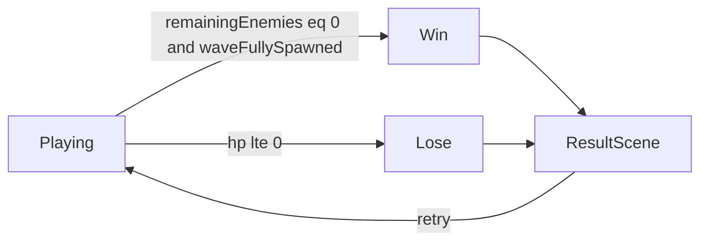

# US-114 — Win and lose

Define survival victory and defeat and hand off to the result flow.

## Meta

- **Roadmap ID:** US-114
- **Epic:** E1 — Core combat
- **Status:** Not started.
- **Done when:** `remainingEnemies === 0 && waveFullySpawned` → win; `roverHp <= 0` → lose.
- **Source of truth:** [MVP.md](../../MVP.md), [ROADMAP.md](../../ROADMAP.md)
- **Rules:** `.cursor/rules/` (premises, architecture, TypeScript, Phaser, English)

## Prerequisites

- US-113

## Out of scope

- WaveSpawnSystem and `waveFullySpawned` from bursts (US-131) — stub `waveFullySpawned = true` if waves not wired yet
- Coin payout logic (US-144)
- Save unlock on win (US-142)
- Star ratings or time bonuses

Global MVP exclusions: energy/clean-map win conditions, magnet/cargo loop.

## Likely files

- `src/game/systems/RunState.ts`
- `src/game/scenes/GameScene.ts`
- `src/game/scenes/ResultScene.ts`
- `src/game/systems/CombatSystem.ts`
- `src/game/systems/HpSystem.ts`

## Context

Survival win requires all enemies eliminated and the wave fully spawned (`waveFullySpawned`). Until US-131, set `waveFullySpawned` true when all initial enemies are placed. Lose when `HpSystem` reports dead. Stop input and systems on end; transition to `ResultScene` with outcome payload. Retry restarts the stage with fresh HP and enemies.

## Implementation

1. Extend `RunState` (or equivalent) with survival states: `Playing`, `Won`, `Lost`.
2. Each frame after combat update: if `hp <= 0` → `Lost`; else if `remainingEnemies === 0 && waveFullySpawned` → `Won`.
3. On terminal state: freeze movement input, stop spawning/combat updates as needed.
4. Transition to `ResultScene` with `{ outcome: 'win' | 'lose', kills?, stageId? }` — coins placeholder OK.
5. Update `ResultScene` copy for survival (remove magnet/clean-map text).
6. Retry button restarts `GameScene` with reset HP, respawned enemies, and reset wave flags.

## Constraints

- Do not win while enemies remain or spawns are pending (when wave system exists).
- Clear map / empty cargo must not trigger win.
- English user-facing result copy.

## Autonomous execution checklist

1. Read this plan end-to-end and the linked roadmap story US-114.
2. Inspect current `src/game/` before editing; reuse existing patterns (`GameConfig`, Container placeholders, arcade lerp).
3. Implement todos in order; keep the scene as a wirer and put math in systems/entities.
4. Run `npm run build` (and `npm run dev` smoke) before declaring done.
5. Mark todos completed in this file's frontmatter as you finish them.
6. Do not expand into neighboring user stories unless required to compile/run.

## Verify

- Clearing all enemies triggers win → ResultScene.
- HP reaching 0 triggers lose → ResultScene.
- Retry starts a fresh run with full HP and enemies back.
- Legacy clean-map / energy lose paths removed.

## Stop conditions

Stop when **Done when** is satisfied and verify checks pass. Do not start the next US in the same execution unless the user explicitly asks.
