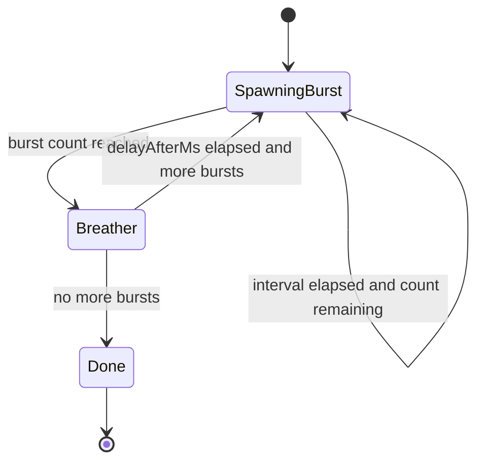

# US-131 — WaveSpawnSystem

Spawn enemies in bursts with breathers between groups without pausing gameplay.

## Meta

- **Roadmap ID:** US-131
- **Epic:** E3 — Waves
- **Status:** Not started.
- **Done when:** Spawns follow burst schedule; during `delayAfterMs` no new spawns; game does not pause.
- **Source of truth:** [MVP.md](../../MVP.md), [ROADMAP.md](../../ROADMAP.md)
- **Rules:** `.cursor/rules/` (premises, architecture, TypeScript, Phaser, English)

## Prerequisites

- US-130
- US-112

## Out of scope

- Wave HUD (US-132)
- Win check wiring for `waveFullySpawned` (already in US-114 — connect here)
- Multiple waves per stage
- Pausing the game during breather

Global MVP exclusions: forced pause between bursts.

## Likely files

- `src/game/systems/WaveSpawnSystem.ts` (new)
- `src/game/config/StageConfig.ts`
- `src/game/entities/Enemy.ts`
- `src/game/scenes/GameScene.ts`
- `src/game/systems/CombatSystem.ts` (remainingEnemies init)

## Context

`WaveSpawnSystem` reads `StageConfig.wave.bursts`. State machine: for each burst, spawn enemies on `intervalMs` until `count` reached, wait `delayAfterMs`, advance to next burst. Set `waveFullySpawned = true` when all bursts complete. Player keeps moving and fighting during breathers. Spawn positions: offset from rover or random edge point — avoid spawning on top of player.

## Implementation

1. Create `WaveSpawnSystem` with burst index, spawned-in-burst count, timers.
2. `update(delta)`: advance spawn timer; spawn enemy via factory when due.
3. Expose `waveFullySpawned` getter when all bursts finished.
4. On spawn: increment `remainingEnemies` in combat/run state.
5. Pick spawn position: min distance from rover (config offset) and inside map bounds.
6. Remove manual enemy spawn from `GameScene` — wave system owns spawning.

## Constraints

- Game never pauses for breather — only spawn timer stops.
- Spawn logic in system, not scene.
- Cheap per-frame updates.

## Autonomous execution checklist

1. Read this plan end-to-end and the linked roadmap story US-131.
2. Inspect current `src/game/` before editing; reuse existing patterns (`GameConfig`, Container placeholders, arcade lerp).
3. Implement todos in order; keep the scene as a wirer and put math in systems/entities.
4. Run `npm run build` (and `npm run dev` smoke) before declaring done.
5. Mark todos completed in this file's frontmatter as you finish them.
6. Do not expand into neighboring user stories unless required to compile/run.

## Verify

- Enemies appear in timed bursts with visible gaps between bursts.
- Player can move and fight during breathers.
- `waveFullySpawned` false until last burst done; true after.
- Win only possible after `waveFullySpawned` (with US-114).

## Stop conditions

Stop when **Done when** is satisfied and verify checks pass. Do not start the next US in the same execution unless the user explicitly asks.
