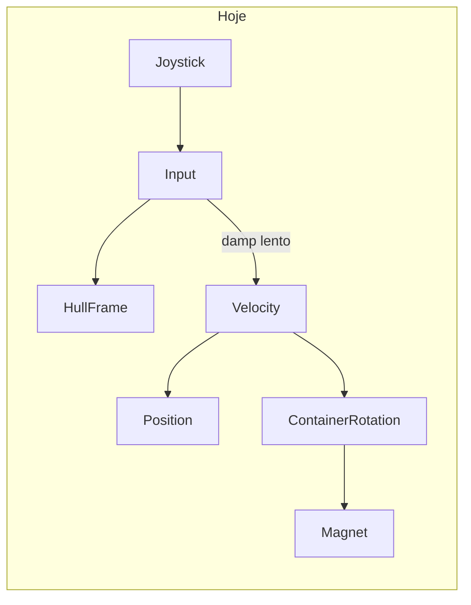
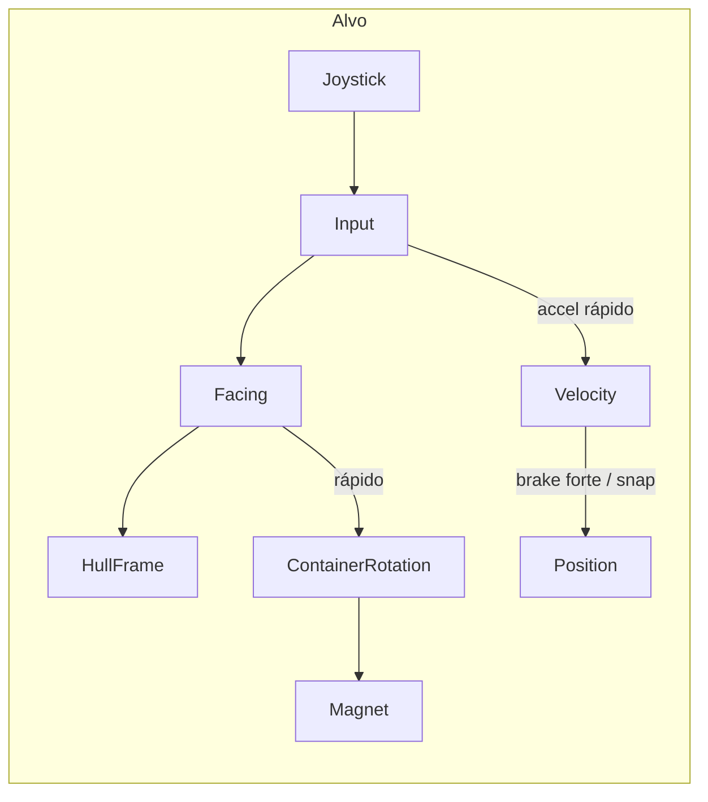
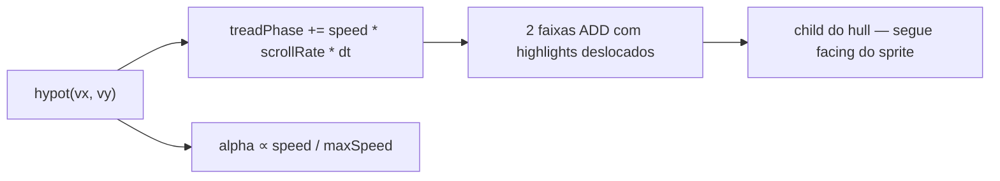

# US-162 — Rover movement feel

## Diagnóstico

O rover hoje usa um modelo de **velocidade com damping simétrico** em [`Rover.ts`](src/game/entities/Rover.ts):

```104:137:src/game/entities/Rover.ts
  public updateRover(delta: number): void {
    const input = this.readMoveInput();
    // ...
    this.velocityX = this.damp(this.velocityX, input.x * speed, GameConfig.rover.inputSmoothing, delta);
    this.velocityY = this.damp(this.velocityY, input.y * speed, GameConfig.rover.inputSmoothing, delta);
    // posição integra velocidade; rotação segue velocidade (não o input)
    if (this.isMoving) {
      const targetRotation = Math.atan2(this.velocityX, -this.velocityY);
      this.rotation = PhaserMath.Angle.RotateTo(...);
    }
    this.syncHullFrame(input);
  }
```

Isso gera três problemas perceptíveis:

1. **Coast ao soltar o stick** — `inputSmoothing: 0.18` desacelera devagar; o rover continua deslizando.
2. **Rotação atrasa o input** — o container (ímã, fila de carga) gira em direção à **velocidade**, enquanto o sprite já tenta seguir o **input**; ao mudar de direção no joystick, o visual aponta para um lado e o movimento vai para outro.
3. **Quantização grosseira** — sprites em passos de 45° (8 dirs) em [`syncHullFrame`](src/game/entities/Rover.ts); mudanças sutis do joystick saltam entre frames distantes.



## Direção proposta

Alinhar **input → facing → movimento** quando o stick estiver ativo, mantendo arcade feel (sem física real) conforme [`phaser.mdc`](.cursor/rules/phaser.mdc):



---

## Fase 1 — Ajuste de feel (código)

### 1.1 Novos tunables em [`GameConfig.ts`](src/game/config/GameConfig.ts)

Adicionar em `rover`:

| Chave | Valor inicial sugerido | Propósito |
|---|---|---|
| `accelSmoothing` | `0.35` | resposta rápida ao toque |
| `brakeSmoothing` | `0.55` | parada mais firme ao soltar |
| `rotationSmoothing` | `0.45` | container acompanha o input mais de perto |
| `stopSnapSpeed` | `12` | abaixo disso + sem input → velocidade = 0 |
| `directionCount` | `16` | frames do spritesheet |

Manter `inputSmoothing` temporariamente como alias de `accelSmoothing` ou removê-lo num único commit para evitar drift.

### 1.2 Refatorar `updateRover` em [`Rover.ts`](src/game/entities/Rover.ts)

**Aceleração assimétrica:**
- Com input ativo (`|input| > deadzone`): damp com `accelSmoothing` em direção a `input × speed`.
- Sem input: damp com `brakeSmoothing` em direção a `(0, 0)`; se `hypot(vx, vy) < stopSnapSpeed`, zerar velocidade.

**Rotação alinhada ao input:**
- Se há input: `targetRotation = atan2(input.x, -input.y)` (mesma convenção Phaser já usada).
- Se não há input mas ainda há velocidade residual: usar velocidade como fallback (coast visual curto).
- Aumentar `rotationSmoothing` para reduzir lag; opcionalmente usar snap instantâneo quando `|angleDelta| < ~5°` para evitar micro-oscilação.

**Hull frame:**
- Sempre derivar facing do **input** quando ativo; nunca só da velocidade durante pilotagem.
- Extrair lógica para utilitário compartilhado (ver Fase 2).

### 1.3 Verificações de regressão

- [`EnergySystem`](src/game/systems/EnergySystem.ts) usa `rover.isMoving` — comportamento deve permanecer (drain só com movimento real).
- [`resolveSolidRect`](src/game/entities/Rover.ts) — manter slide tangencial em paredes (intencional); não misturar com brake no ar.
- [`GameCameras.ts`](src/game/cameras/GameCameras.ts) — **não alterar** `camera.lerp` nesta tarefa (lag de câmera ≠ slide do rover); reavaliar só se ainda parecer floaty após o fix.

---

## Fase 2 — Sprites 16 direções

### 2.1 Pipeline Blender

Atualizar [`render_rover_sprites.py`](tools/blender/render_rover_sprites.py):

- `FRAME_COUNT = 16`
- `YAW_STEP_DEG = 22.5`
- Nomes de saída: `rover_n`, `rover_nne`, `rover_ne`, … (16 arquivos) ou `rover_00`…`rover_15` — manter convenção documentada.
- Strip packed: `rover.png` passa de **2048×256** para **4096×256**.

Atualizar tabela de índices em [`SPRITE_CAMERA.md`](tools/blender/SPRITE_CAMERA.md) (16 linhas, passo 22,5°).

Regenerar assets:

```bash
npm run sprites:rover
```

*(Requer Blender instalado no ambiente local.)*

### 2.2 Utilitário de facing

Criar [`src/game/rover/roverFacing.ts`](src/game/rover/roverFacing.ts):

```ts
export function angleToRoverFrame(angle: number, directionCount: number): number
export function moveInputToFacing(input: MoveInput): number | null
```

- `angleToRoverFrame`: `round(wrap(angle) / (2π / directionCount)) % directionCount`
- Tipar frames como `RoverFacingFrame` (0..15) para substituir magic numbers (ex.: garage `roverFrame: 3`).

### 2.3 Carregamento Phaser

Em [`BootScene.ts`](src/game/scenes/BootScene.ts), o spritesheet já usa `frameWidth/Height` de `GameConfig.rover.spriteFrameSize`; nenhuma mudança estrutural — só garantir que o asset tenha 16 frames.

Atualizar [`GameConfig.garage.roverFrame`](src/game/config/GameConfig.ts) se o índice SE mudar na nova ordem (manter facing SE visualmente).

### 2.4 Consumidores

| Arquivo | Mudança |
|---|---|
| [`Rover.ts`](src/game/entities/Rover.ts) | usar `angleToRoverFrame` + `directionCount` |
| [`RoverShowcase.ts`](src/game/ui/RoverShowcase.ts) | frame estático via constante nomeada |

---

## Fase 3 — Brilho procedural nas lagartas

Sim, **100% procedural** — sem novos sprites. O rover já usa `Graphics` para o ímã (`drawMagnetCue`); o mesmo padrão serve para as lagartas.

### 3.1 Conceito

Duas faixas de brilho (esquerda/direita) desenhadas **em cima do hull**, alinhadas às lagartas do sprite. Um `treadPhase` acumula com a velocidade; segmentos de highlight “correm” ao longo do eixo frontal→traseiro das lagartas, vendendo a ideia de esteira em movimento.



### 3.2 Implementação

Novo arquivo [`src/game/entities/RoverTreadFx.ts`](src/game/entities/RoverTreadFx.ts):

- `Graphics` filho do `hull` (não do container), para acompanhar o counter-rotate e ficar colado nas lagartas em qualquer facing.
- `update(speed: number, delta: number)` chamado de `Rover.updateRover`.
- A cada frame: `clear()` + redesenhar 2×N segmentos (retângulos arredondados ou linhas grossas).
- `setBlendMode(ADD)` para brilho; cor quente (`0xfff4e6`) ou `roverAccent` com alpha baixo.
- `treadPhase` só avança quando `speed > moveEpsilon`; alpha decai rápido ao parar (sem brilho parado).

Posições em espaço local do hull (tunáveis em `GameConfig.rover.tread`):

| Chave | Valor inicial | Propósito |
|---|---|---|
| `offsetX` | `±11` | centro de cada lagarta |
| `length` | `30` | comprimento ao longo do corpo |
| `width` | `4` | largura da faixa |
| `segmentCount` | `3` | highlights por lagarta |
| `segmentLength` | `7` | tamanho de cada brilho |
| `scrollRate` | `0.018` | fase por px/s percorrido |
| `maxAlpha` | `0.5` | intensidade em velocidade máxima |
| `fadeSmoothing` | `0.35` | decay de alpha ao parar |

Algoritmo de scroll (eixo local **Y**, frente = negativo):

```ts
for (let side of [-1, 1]) {
  for (let i = 0; i < segmentCount; i++) {
    const t = (treadPhase + i / segmentCount) % 1;
    const y = PhaserMath.Linear(-length / 2, length / 2, t);
    // fillRoundedRect(side * offsetX - width/2, y - segmentLength/2, ...)
  }
}
```

### 3.3 Integração em [`Rover.ts`](src/game/entities/Rover.ts)

Ordem de filhos no container (de trás para frente):

1. `magnetCue` Graphics (já existe, atrás)
2. `hull` Sprite
3. `RoverTreadFx` Graphics (filho do hull, blend ADD)

`Rover` expõe velocidade escalar internamente; `RoverTreadFx` não lê input — só `hypot(vx, vy)` para ficar sincronizado com movimento real (inclui coast curto após brake).

### 3.4 Escopo e limites

- **In scope:** highlight procedural, velocidade-proporcional, fade ao parar.
- **Out of scope:** textura de lagarta animada no Blender, partículas de poeira, som de motor.
- **Garage/showcase:** sem tread FX (só in-run) — evita distração no menu.

### 3.5 Validação visual

- Parado: zero brilho visível.
- Movimento lento: scroll lento, alpha baixo.
- Velocidade máxima / boost: scroll rápido, brilho perceptível mas não ofuscando o sprite.
- Curvas: highlights acompanham lagartas (hull-local) sem desalinhamento.
- Performance: um `Graphics.clear()` + ~6 shapes/frame — negligível em Android alvo.

---

## Fase 4 — Tuning manual (playtest)

Checklist de validação no device/emulador:

1. **Parada** — soltar joystick: rover para em ~0,2–0,4 s, sem patinar longe; lagartas apagam junto.
2. **Mudança de direção** — girar stick 90°: sprite, ímã e tread glow viram juntos.
3. **Joystick analógico** — inclinação parcial = velocidade e brilho proporcionais.
4. **Diagonais** — 16 dirs reduzem saltos visíveis vs 8 dirs.
5. **Paredes** — ainda desliza ao longo da parede, mas não atravessa; tread glow acompanha velocidade tangencial.
6. **Carga/ímã** — fila segue `container.rotation` sem jitter.
7. **Energia** — drena ao mover, para ao ficar parado.

Ajustar `accelSmoothing`, `brakeSmoothing`, `rotationSmoothing`, `stopSnapSpeed` e `rover.tread.*` até o feel ficar “arcade responsivo”, não “gelo”.

---

## Escopo fora deste plano

- Animações de lagarta baked no spritesheet (frames de esteira)
- Rotação contínua do sprite (sem baked angles)
- Mudança de `camera.lerp`
- Novos skins/variantes do rover
- Partículas de poeira / trilha no chão

## Arquivos principais

- [`src/game/entities/Rover.ts`](src/game/entities/Rover.ts) — lógica de movimento e facing
- [`src/game/entities/RoverTreadFx.ts`](src/game/entities/RoverTreadFx.ts) — brilho procedural das lagartas
- [`src/game/config/GameConfig.ts`](src/game/config/GameConfig.ts) — tunables
- [`src/game/rover/roverFacing.ts`](src/game/rover/roverFacing.ts) — novo utilitário
- [`tools/blender/render_rover_sprites.py`](tools/blender/render_rover_sprites.py) — 16-dir render
- [`tools/blender/SPRITE_CAMERA.md`](tools/blender/SPRITE_CAMERA.md) — documentação de índices
- [`public/assets/sprites/rover/rover.png`](public/assets/sprites/rover/rover.png) — asset regenerado
