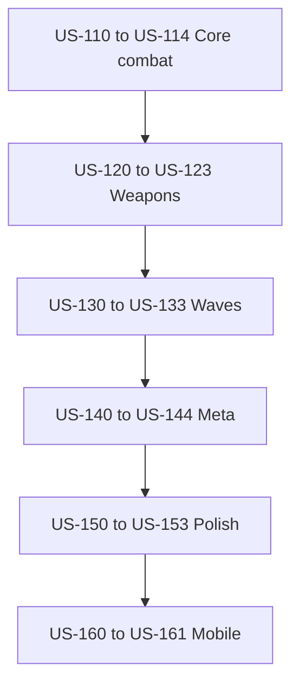

# Execute survival roadmap (US-110 → US-161)

## Workflow

For each plan file, in order:

1. **Open** the plan under [`.cursor/plans/`](.cursor/plans/).
2. **Read** that file only (meta, prerequisites, out of scope, implementation steps, todos).
3. **Implement** everything the plan requires against the current codebase. Follow [MVP.md](../../MVP.md) and [ROADMAP.md](../../ROADMAP.md) as source of truth over outdated rule copy in AGENTS.md if it still mentions magnet/scrap.
4. **Mark todos done** in that plan's frontmatter when the work is complete.
5. Run `npm run build` (and smoke `npm run dev` when useful) before moving on.
6. **Move on** to the next plan — do not skim ahead.

Do not batch-analyze plans. Context for story *N* comes from the repo state after stories `110…N-1` and from the opened plan itself.

Do **not** commit or push unless the user explicitly asks.

## Order (24 plans)

| # | Plan file |
|---|-----------|
| 1 | [US-110-strip-legacy.plan.md](US-110-strip-legacy.plan.md) |
| 2 | [US-111-rover-hp.plan.md](US-111-rover-hp.plan.md) |
| 3 | [US-112-enemy-placeholder.plan.md](US-112-enemy-placeholder.plan.md) |
| 4 | [US-113-contact-damage.plan.md](US-113-contact-damage.plan.md) |
| 5 | [US-114-win-and-lose.plan.md](US-114-win-and-lose.plan.md) |
| 6 | [US-120-weapon-definitions.plan.md](US-120-weapon-definitions.plan.md) |
| 7 | [US-121-weapon-system-auto-fire.plan.md](US-121-weapon-system-auto-fire.plan.md) |
| 8 | [US-122-projectiles-and-hits.plan.md](US-122-projectiles-and-hits.plan.md) |
| 9 | [US-123-weapon-feel.plan.md](US-123-weapon-feel.plan.md) |
| 10 | [US-130-stage-config.plan.md](US-130-stage-config.plan.md) |
| 11 | [US-131-wave-spawn-system.plan.md](US-131-wave-spawn-system.plan.md) |
| 12 | [US-132-wave-hud.plan.md](US-132-wave-hud.plan.md) |
| 13 | [US-133-five-stage-recipes.plan.md](US-133-five-stage-recipes.plan.md) |
| 14 | [US-140-save-migration.plan.md](US-140-save-migration.plan.md) |
| 15 | [US-141-inventory-scene.plan.md](US-141-inventory-scene.plan.md) |
| 16 | [US-142-weapon-unlocks.plan.md](US-142-weapon-unlocks.plan.md) |
| 17 | [US-143-garage-repurpose.plan.md](US-143-garage-repurpose.plan.md) |
| 18 | [US-144-coins-from-combat.plan.md](US-144-coins-from-combat.plan.md) |
| 19 | [US-150-tutorial-rewrite.plan.md](US-150-tutorial-rewrite.plan.md) |
| 20 | [US-151-combat-juice.plan.md](US-151-combat-juice.plan.md) |
| 21 | [US-152-minimap-update.plan.md](US-152-minimap-update.plan.md) |
| 22 | [US-153-audio-pass.plan.md](US-153-audio-pass.plan.md) |
| 23 | [US-160-capacitor-regression.plan.md](US-160-capacitor-regression.plan.md) |
| 24 | [US-161-performance.plan.md](US-161-performance.plan.md) |

## Epic flow

## Per-plan execution rules

- Respect each plan's **Prerequisites** and **Out of scope**.
- Follow `.cursor/rules/` (architecture, TypeScript, Phaser, English).
- Survival MVP scope: no magnet/cargo/energy loop, no pathfinding, no Arcade Physics, no regenerative HP.
- Prefer files and steps named in the opened plan; only read extra code needed to implement that story.
- After each story: leave the game in a coherent, buildable state for the next plan.

## Autonomous execution checklist

1. Open the next pending todo in this orchestrator plan.
2. Open only the linked US plan file — do not read ahead.
3. Execute that US plan fully (implementation + mark its todos completed).
4. Mark the matching orchestrator todo completed.
5. Repeat until all 24 US plans are done.

## Stop conditions

Stop when all orchestrator todos are completed (US-110 through US-161 implemented). Do not commit or push unless the user explicitly asks.

## Start

Begin with [US-110-strip-legacy.plan.md](US-110-strip-legacy.plan.md) immediately after approval; continue until US-161 is done.
